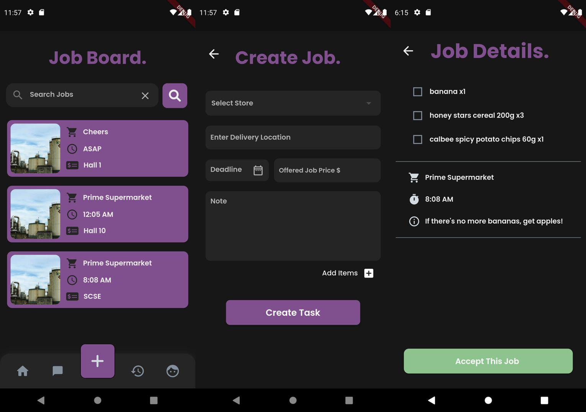

# uGrab v1

## App Description:

Are you tired of spending precious time commuting, waiting in line, and then commuting back just for a quick meal or simple purchase? If you'd rather focus on more important tasks and avoid the hassle of leaving your room, we have the perfect solution for you!

Introducing uGrab, a delivery service mobile app designed specifically for NTU students. Our platform enables you to post item purchase and delivery requests or accept such tasks from your fellow students.

uGrab's mission is to address the challenges faced by students who need to buy something urgently but cannot do so themselves due to time constraints, inconvenience, or other reasons. By connecting students with one another, we make it easy for you to get the items you need while empowering others to help you out. Experience the convenience of uGrab and revolutionize the way you shop on campus!



## Tools and Frameworks:

This app is developed in flutter, with firebase database integration.

## How to run:

## Getting Started:

Have the latest version of Flutter SDK and Android Studio installed. For more setup instructions, refer to this [link](https://www.liquidweb.com/kb/how-to-install-and-configure-flutter-sdk-windows-10/).

Clone repository into desired file location.

For projects with Firestore integration, you must first run the following commands to ensure the project compiles:

```
flutter pub get
flutter packages pub run build_runner build --delete-conflicting-outputs
```

This command creates the generated files that parse each Record from Firestore into a schema object.

Have an emulator device open in Android Studio. For setup details, refer to this [link](https://developer.android.com/studio/run/managing-avds)

Connect to emulator device on IDE. (If using Visual Studio Code, click on "chrome" on the bottom right hand corner and select emulator device)

run the following command to run the app in emulator:

```
flutter run
```

Note: main source code is in lib/ directory.
